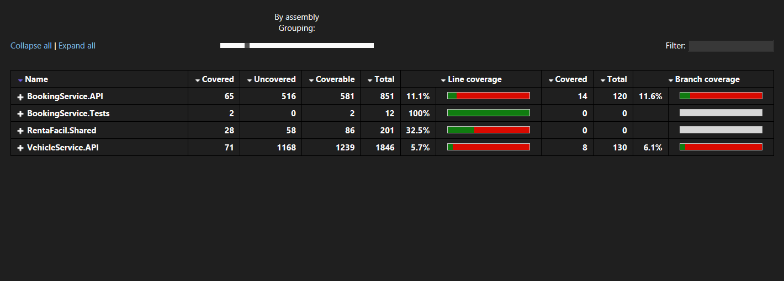
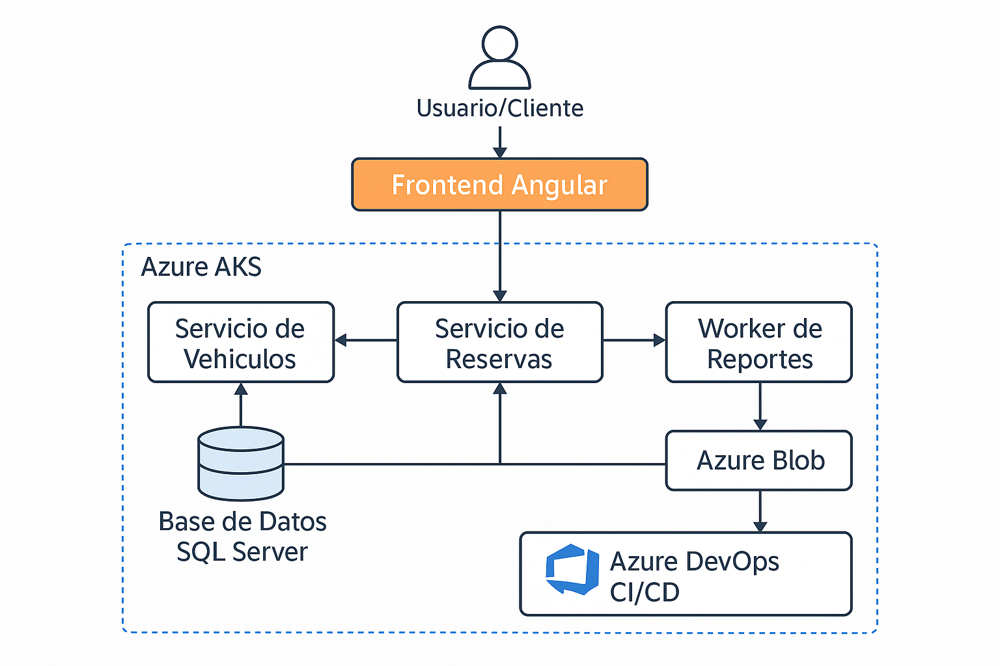

**Junio 2025**

## Detalle 

**Objetivo:**
Construir un sistema básico para la gestión de reservas de vehículos, aplicando buenas prácticas de desarrollo, principios de arquitectura, uso de microservicios, SQL Server, C# .NET, Angular, integración con Azure y uso de Git.

**Escenario:**
RentaFácil S.A.S. es una empresa de alquiler de vehículos que necesita una solución para:
- Registrar reservas de vehículos.
- Consultar disponibilidad por tipo de vehículo y fechas.
- Asociar un cliente a una reserva.
- Consultar el historial de reservas por cliente.

**Requisitos Técnicos**
1. **Backend (.NET 8 o superior)**
   - Crear dos microservicios:
     - **VehicleService**: Registrar vehículos, consultar disponibilidad por tipo/fecha.
     - **BookingService**: Crear reserva, asignar cliente, consultar historial de reservas por cliente.
     - **Worker para reporte**: Procesa todas las solicitudes del día y las guarda en una tabla para reporte.
   - Detalles:
     - Base de datos SQL Server (local o en contenedor).
     - ORM: Entity Framework Core.
     - API REST con Swagger.
     - Buen manejo de errores y validaciones.
     - Logs simples en consola o archivo.
2. **Frontend (Angular 18+)**
   - Formulario para buscar vehículos disponibles por fecha.
   - Formulario para crear una reserva con cliente.
   - Vista de historial de reservas por cliente (con filtros).
3. **Azure (teórico/práctico)**
   - Describir (o implementar) cómo se desplegarían los microservicios y la base de datos en Azure:
     - Contenedores (AKS).
     - Base de datos SQL.
     - Azure DevOps para CI/CD.
   - Nota: Utiliza una cuenta de Azure para este ejercicio.
4. **Buenas prácticas y arquitectura**
   - Aplicar principios SOLID.
   - Definir modelos DTO para la comunicación entre capas.
   - Usar el gestor de código Git con commits organizados por funcionalidades.
   - Documentar el proyecto y justificar decisiones de diseño.
   - Implementar Clean Architecture y/o Domain Driven Design.
   - Utilización de patrones de diseño (Mediator, command, factory, facade, adapters, etc.)

**Entregables**
1. Repositorio Git (privado o público)
2. README.md con:
   - Instrucciones de instalación local (puede usar Docker Compose).
   - Arquitectura del sistema (diagrama opcional).
   - Buenas prácticas aplicadas.
   - Opcional: Postman Collection para probar la API.
   - Informe de análisis de código estático (finecodecoverage > 10%)

---

## 🔐 Acceso a Recursos en Azure y Firewalls

> **IMPORTANTE:**
> Por motivos de seguridad, los recursos en Azure (como la base de datos SQL, APIs, etc.) están protegidos por reglas de firewall que solo permiten el acceso desde ciertas direcciones IP.
>
> - Si necesitas conectarte a la base de datos o a los servicios desde tu equipo, **asegúrate de que tu IP pública esté permitida en el firewall de Azure**.
> - Si recibes errores de conexión, revisa primero este punto.
> - Para solicitar acceso, contacta al  usuario administrador del recurso  Brandon Landaetta


---

# RentaFacil - Sistema de Gestión de Reservas de Vehículos

## 📋 Descripción

RentaFacil es un sistema completo de gestión de reservas de vehículos desarrollado con arquitectura de microservicios, utilizando .NET 8, Angular 18+ y Azure SQL Database. Permite a usuarios buscar vehículos disponibles, realizar reservas, gestionar clientes y administrar el sistema de forma centralizada y segura.

## 🏗️ Arquitectura

### Backend (Microservicios)
- **VehicleService**: Gestión de vehículos, consulta de disponibilidad, autenticación y administración de usuarios/clientes.
- **BookingService**: Gestión de reservas, historial, validaciones de negocio y consulta de reservas por cliente o vehículo.
- **Worker**: Procesamiento automático de reportes diarios de reservas, almacenando históricos para análisis.
- **RentaFacil.Shared**: Entidades y DTOs compartidos entre microservicios.

### Frontend
- **Angular 18+**: Aplicación web moderna con Angular Material y componentes standalone.
- **Gestión de reservas**: Búsqueda, creación y visualización de reservas.
- **Panel de administración**: Gestión de vehículos, usuarios y reservas para administradores.
- **Responsive Design**: Adaptable a dispositivos móviles y escritorio.

### Base de Datos
- **Azure SQL Database**: Base de datos centralizada en la nube.
- **Entity Framework Core**: ORM para .NET, con migraciones y control de versiones de esquema.

## 🚀 Instalación Local

### Prerrequisitos
- .NET 8 SDK
- Node.js 18+
- SQL Server (local o Azure)
- Visual Studio 2022 o VS Code

### 1. Clonar el repositorio
```bash
git clone <repository-url>
cd RentaFacil
```

### 2. Configurar Base de Datos
```bash
# Crear base de datos
CREATE DATABASE rentafacil;

# Ejecutar migraciones
# (Asegúrate de tener la cadena de conexión correcta en appsettings.json)
dotnet ef database update --project BookingService.API/BookingService.API/ --startup-project BookingService.API/BookingService.API/
dotnet ef database update --project VehicleService.API/VehicleService.API/ --startup-project VehicleService.API/VehicleService.API/
```

### 3. Configurar APIs
```bash
# BookingService
cd BookingService.API/BookingService.API/
dotnet run

# VehicleService (en otra terminal)
cd VehicleService.API/VehicleService.API/
dotnet run
```

### 4. Configurar Frontend
```bash
cd renta-facil-frontend/renta-facil-frontend/
npm install
ng serve
```

### 5. Acceder a la aplicación
- **Frontend**: http://localhost:4200
- **BookingService Swagger**: https://localhost:7216/swagger
- **VehicleService Swagger**: https://localhost:7280/swagger

## 📊 Funcionalidades

### VehicleService
- ✅ Registrar, editar y eliminar vehículos (con imágenes)
- ✅ Consultar disponibilidad por tipo y fechas
- ✅ Gestión de usuarios y clientes (registro, login, edición, cambio de contraseña)
- ✅ API REST con Swagger

### BookingService
- ✅ Crear reservas con validaciones de solapamiento y fechas
- ✅ Asignar clientes a reservas
- ✅ Consultar historial por cliente y por vehículo
- ✅ Cancelar y actualizar reservas
- ✅ Validaciones de negocio estrictas

### Frontend
- ✅ Buscar vehículos disponibles por tipo y fechas
- ✅ Crear nuevas reservas (con validación de solapamiento y fechas ocupadas)
- ✅ Ver historial de reservas por usuario
- ✅ Panel de administración para vehículos, usuarios y reservas
- ✅ Interfaz moderna y responsiva con Angular Material

### Worker
- ✅ Procesamiento automático de reportes diarios de reservas
- ✅ Almacenamiento de históricos en base de datos para análisis

## 🏛️ Arquitectura y Buenas Prácticas

### Clean Architecture
- **Separación de capas**: API, Application, Domain, Infrastructure
- **Dependency Injection**: Configurado en Program.cs
- **DTOs**: Separación entre entidades de dominio y transferencia de datos

### SOLID Principles
- **Single Responsibility**: Cada servicio tiene una responsabilidad específica
- **Open/Closed**: Extensible sin modificar código existente
- **Liskov Substitution**: Interfaces bien definidas
- **Interface Segregation**: Interfaces específicas por funcionalidad
- **Dependency Inversion**: Dependencias hacia abstracciones

### Patrones de Diseño
- **Repository Pattern**: Entity Framework como implementación
- **Service Layer**: Lógica de negocio encapsulada
- **DTO Pattern**: Transferencia de datos estructurada
- **Factory Pattern**: Creación de objetos complejos

### Domain Driven Design (DDD)
- **Entidades de Dominio**: Vehicle, Booking, Client, Usuario, BookingHistory
- **Value Objects**: Fechas, estados, identificadores
- **Aggregates**: Agrupación lógica de entidades

## 🔒 Autenticación y Gestión de Usuarios

- **Registro y login**: Usuarios y clientes se registran y autentican mediante JWT.
- **Roles**: Soporte para roles "Admin" y "Usuario".
- **Gestión de perfil**: Edición de datos personales y cambio de contraseña desde el frontend.
- **Protección de rutas**: Guards en Angular y políticas de autorización en backend.

## 🔄 Flujo de Reserva de Vehículos (End-to-End)

1. **Búsqueda de vehículos**: El usuario filtra por tipo y fechas en el frontend, que consulta `/api/vehicles/available`.
2. **Selección y validación**: El usuario selecciona un vehículo y rango de fechas. El frontend valida localmente y consulta fechas ocupadas (`/api/bookings/vehicle/{vehicleId}/booked-dates`).
3. **Creación de reserva**: El usuario confirma y el frontend envía la reserva a `/api/bookings` (requiere login).
4. **Validación en backend**: BookingService valida solapamientos, fechas y existencia de cliente/vehículo antes de guardar.
5. **Historial y administración**: El usuario puede ver su historial (`/api/bookings/history/{clientId}`) y los administradores gestionan todas las reservas y usuarios.

## 📝 API Endpoints (Principales)

### VehicleService
```
POST   /api/vehicles                - Registrar vehículo
GET    /api/vehicles                - Listar todos los vehículos
GET    /api/vehicles/available      - Consultar disponibilidad (filtros: type, startDate, endDate)
PUT    /api/vehicles/{id}           - Editar vehículo (Admin)
DELETE /api/vehicles/{id}           - Eliminar vehículo (Admin)

# Autenticación y usuarios
POST   /api/auth/register           - Registrar usuario/cliente
POST   /api/auth/login              - Login y obtención de JWT
GET    /api/auth/all                - Listar usuarios (Admin)
PUT    /api/auth/{id}               - Editar usuario (Admin)
PUT    /api/auth/{id}/password      - Cambiar contraseña
DELETE /api/auth/{id}               - Eliminar usuario (Admin)
```

### BookingService
```
POST   /api/bookings                - Crear reserva
POST   /api/bookings/assign-client  - Asignar cliente a reserva
POST   /api/bookings/cancel         - Cancelar reserva
PUT    /api/bookings/{id}           - Editar reserva
GET    /api/bookings                - Listar todas las reservas (Admin)
GET    /api/bookings/history/{clientId}         - Historial por cliente
GET    /api/bookings/history/{clientId}/details - Historial con detalles de vehículo
GET    /api/bookings/vehicle/{vehicleId}        - Reservas por vehículo
GET    /api/bookings/vehicle/{vehicleId}/booked-dates - Fechas ocupadas de un vehículo
```

## 🧪 Testing

### APIs
- **Swagger UI**: Documentación interactiva y pruebas manuales
- **Colección Postman**: Incluida en `RentaFacil.postman_collection.json` para pruebas automatizadas

### Frontend
- **Unit Tests**: Configurados con Jasmine
- **E2E Tests**: Configurados con Playwright

## 📈 Análisis de Código

### Métricas
- **Fine Code Coverage**: >10% (pendiente)
- **Static Analysis**: Configurado
- **Code Quality**: Seguimiento de buenas prácticas

## 🚀 Despliegue en Azure y Docker

### Infraestructura
- **Azure Container Apps (ACA)**: Microservicios
- **Azure SQL Database**: Base de datos
- **Azure Container Registry (ACR)**: Imágenes Docker
- **Azure DevOps**: CI/CD Pipeline

### Docker Compose
```yaml
version: '3.8'
services:
  bookingservice:
    build: ./BookingService.API/BookingService.API
    ports:
      - "5000:5000"
    environment:
      - ASPNETCORE_ENVIRONMENT=Development
      - ConnectionStrings__DefaultConnection=Server=db;Database=BookingDb;User=sa;Password=Your_password123;
    depends_on:
      - db
    networks:
      - rentafacilnet

  vehicleservice:
    build: ./VehicleService.API/VehicleService.API
    ports:
      - "5001:5001"
    environment:
      - ASPNETCORE_ENVIRONMENT=Development
      - ConnectionStrings__DefaultConnection=Server=db;Database=VehicleDb;User=sa;Password=Your_password123;
    depends_on:
      - db
    networks:
      - rentafacilnet

  worker:
    build: ./RentaFacil.Worker/RentaFacil.Worker
    environment:
      - ASPNETCORE_ENVIRONMENT=Development
      - ConnectionStrings__DefaultConnection=Server=db;Database=WorkerDb;User=sa;Password=Your_password123;
    depends_on:
      - db
    networks:
      - rentafacilnet

  frontend:
    build: ./renta-facil-frontend/renta-facil-frontend
    ports:
      - "4200:80"
    networks:
      - rentafacilnet

networks:
  rentafacilnet:
    driver: bridge
```

## 🧑‍💻 Worker: Procesamiento de Reportes Diarios
- El Worker es un servicio background que cada hora procesa las reservas creadas ese día y almacena un reporte en la base de datos (`BookingHistory`).
- Permite análisis histórico y auditoría de reservas.

## 📚 Documentación Adicional

### Diagramas
- **Arquitectura del Sistema**: Incluido (`diagrama.png`)


## 🤝 Contribución

1. Fork el proyecto
2. Crear una rama para tu feature (`git checkout -b feature/AmazingFeature`)
3. Commit tus cambios (`git commit -m 'Add some AmazingFeature'`)
4. Push a la rama (`git push origin feature/AmazingFeature`)
5. Abrir un Pull Request


## 👥 Autores

- **Desarrollador**: Brandon Landaetta Arboleda
- **Fecha**: 20 Julio 2025
- **Versión**: 1.0.0

## 📊 Fine Code Coverage



## 🗺️ Diagrama de Arquitectura



## 🧪 Colección Postman

La colección Postman con ejemplos para los endpoints de vehículos, reservas y clientes se encuentra en el archivo `RentaFacil.postman_collection.json` en la raíz del proyecto. Puedes importarla directamente en Postman para probar la API. 

## ☁️ Despliegue en Azure: AKS y CI/CD (Explicación Teórica)

### 1. Empaquetado de Microservicios
Cada microservicio (BookingService, VehicleService, Worker, Frontend) se empaqueta como una imagen Docker. Las imágenes se construyen localmente o en un pipeline de CI.

### 2. Publicación en Azure Container Registry (ACR)
Se crea un **Azure Container Registry** (ACR) para almacenar las imágenes Docker. Las imágenes se suben a ACR usando `docker push` o tareas automáticas del pipeline.

### 3. Despliegue en AKS (Azure Kubernetes Service)
- Se crea un clúster de **AKS** (Kubernetes gestionado por Azure).
- Se definen archivos YAML de Kubernetes para cada microservicio:
  - **Deployment**: Define el número de réplicas y la imagen a usar.
  - **Service**: Expone los pods internamente o externamente.
  - **Ingress** (opcional): Para enrutar tráfico HTTP/HTTPS a los servicios.
- Se aplican los manifiestos con `kubectl apply -f <archivo>.yaml` o mediante el pipeline.
- Se configuran **Secrets** y **ConfigMaps** para las cadenas de conexión y variables sensibles.
- El clúster se conecta a la base de datos Azure SQL (con firewall configurado para permitir solo el tráfico desde AKS).

### 4. CI/CD con Azure DevOps
- Se crea un **pipeline** en Azure DevOps con los siguientes pasos:
  1. **Build**: Compila el código y ejecuta pruebas unitarias.
  2. **Docker Build**: Construye las imágenes Docker de cada microservicio.
  3. **Push a ACR**: Sube las imágenes a Azure Container Registry.
  4. **Deploy a AKS**: Usa tareas de Azure DevOps para aplicar los manifiestos YAML y actualizar los servicios en el clúster.
- El pipeline puede usar variables de entorno y secrets almacenados en Azure Key Vault.

### 5. Seguridad y Monitoreo
- Se configuran reglas de firewall en Azure SQL para aceptar solo conexiones desde el clúster de AKS.
- Se habilita el monitoreo con Azure Monitor y logs de contenedores.

---

### Ejemplo de flujo CI/CD en Azure DevOps (teórico)

```yaml
trigger:
  - main

pool:
  vmImage: 'ubuntu-latest'

steps:
  - task: DotNetCoreCLI@2
    displayName: 'Build and Test'
    inputs:
      command: 'build'
      projects: '**/*.csproj'

  - task: Docker@2
    displayName: 'Build and Push Docker Images'
    inputs:
      command: 'buildAndPush'
      repository: '$(ACR_NAME).azurecr.io/bookingservice'
      dockerfile: 'BookingService.API/BookingService.API/Dockerfile'
      tags: 'latest'

  # Repetir para cada microservicio...

  - task: Kubernetes@1
    displayName: 'Deploy to AKS'
    inputs:
      connectionType: 'Azure Resource Manager'
      azureSubscription: '$(AZURE_SUBSCRIPTION)'
      azureResourceGroup: '$(RESOURCE_GROUP)'
      kubernetesCluster: '$(AKS_CLUSTER)'
      namespace: 'default'
      command: 'apply'
      arguments: '-f k8s/deployment.yaml'
```

---

> **Resumen:**
> - Los microservicios se empaquetan como imágenes Docker y se suben a Azure Container Registry.
> - Se despliegan en un clúster de AKS usando manifiestos YAML de Kubernetes.
> - La base de datos Azure SQL se conecta de forma segura al clúster.
> - Un pipeline de Azure DevOps automatiza el build, test, push y despliegue.
> - Toda la infraestructura y configuración está preparada para ser gestionada como código y escalar en la nube de Azure. 
